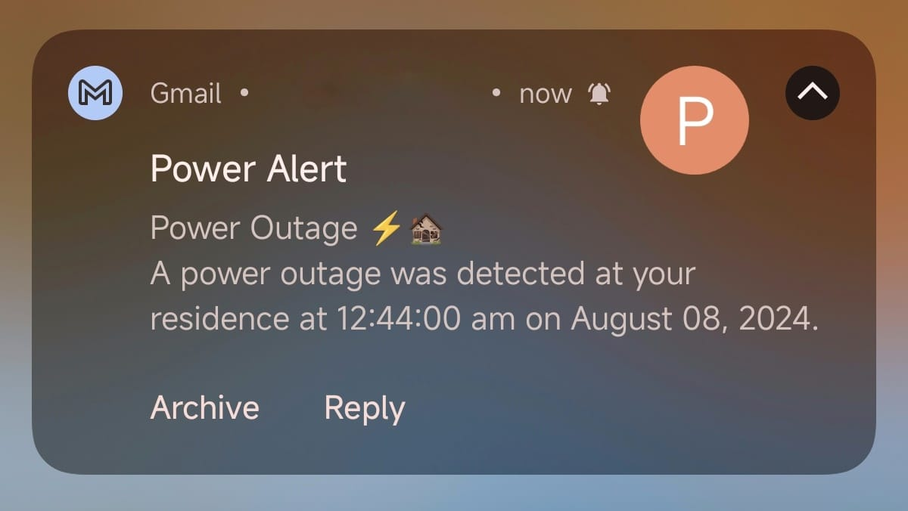
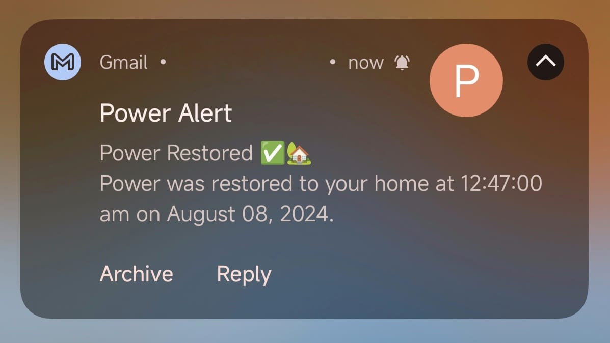
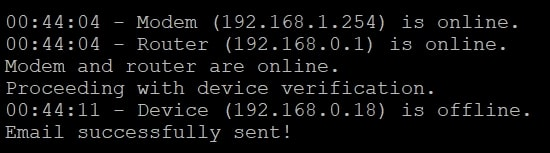

# Power Alert System ⚡
</br>

  <div align="center">
         
  </div>

## Overview 📊

The **Power Alert System** is a Python script designed to monitor your network for power outages. It checks if your modem and router are online. If they are, it proceeds to monitor other specified devices. The script sends email notifications when devices go offline or come back online, keeping you updated on your network status.

**Recommendation**: This script is particularly useful for systems where the network infrastructure (modem, router, and server) is separate from the monitored devices. It ensures that monitoring only begins once the core network is fully operational. For improved reliability, it is recommended to use at least two devices for monitoring: one connected via Ethernet and another via Wi-Fi. This setup helps ensure that network issues affecting one connection type do not prevent the detection of network problems. Tested on Raspberry Pi 4.


<br/>

## Email Notifications 📧

<br/>

<div align="center">
 &nbsp; 
</div>
</br>

## Features 🌟

- **Network Monitoring:** Checks the status of your modem, router, and other specified devices.
- **Email Alerts:** Sends email notifications when a power outage is detected or when power is restored.
- **Locale Support:** Configurable to use different locales for date and time formatting.

## Requirements ✅

- Python 3.x
- Modules: `smtplib`, `email`, `locale` (included with Python)

## Configuration ⚙️

1. **Email Configuration:**

   The script supports sending emails using various SMTP servers. You can configure the script to use your preferred email service by adjusting the SMTP settings. Here are some examples:
   - Outlook: smtp.office365.com
   - Gmail: smtp.gmail.com
   - Yahoo: smtp.mail.yahoo.com

   Make sure to replace the placeholder values with your actual email settings:

   ```python
   sender_email = "SENDER_EMAIL"
   sender_password = "SENDER_EMAIL_PASSWORD"
   receiver_emails = ["RECEIVER_EMAIL_1", "RECEIVER_EMAIL_2"]
   smtp_server = "SMTP_SERVER"  # e.g., smtp.office365.com for Outlook
   smtp_port = 587
   ```

3. **Device IPs:**

   Set the IP addresses of the devices you want to monitor:
    ```python
   device_ips = ['192.168.0.23', '192.168.0.9']
    ```

   Configure the IP addresses for your modem and router:
   ```python
    modem_ip = '192.168.1.254'
    router_ip = '192.168.0.1'
   ```

4. **Locale Setting:**
  The script is configured to use a default locale for date and time formatting, specifically 'C', to ensure consistent behavior across different systems. If you need a different locale, you can adjust the following line:
   ```python
    locale.setlocale(locale.LC_TIME, 'C') # Default locale
   ```

## Usage 🚀

1. **Run the Script:**

   Execute the script using Python:
   ```python
   python power_alert.py
   ```

1. **Script Behavior:**
   - The script first checks if the modem and router are online. If either is offline, it will wait until both are online.
   - Once the network devices are confirmed online, it monitors the specified devices.
   - If all monitored devices are offline are detected as offline for more than 3 consecutive checks, an email alert is sent indicating a power outage.
   - If at least one monitored device comes back online, an email alert is sent indicating that power has been restored.

  </br>
  <div align="center">
         
  </div>
  
## Notes 📝

- **Robustness for Service Use:** This script is designed to be reliable for use as a service. It ensures that the monitoring and notification processes are resilient to network infrastructure changes. Specifically:

  - The script will continue to function properly even if the modem or router is restarted or if there are delays in their initialization.
  - It waits for both the modem and router to be online before proceeding with the monitoring of other devices.
  - This design guarantees that you will receive accurate notifications about power outages and restorations, regardless of the network's state or timing issues.

- Ensure you have network access to the devices and email server specified.

- Adjust the `time.sleep(10)` interval as needed for your monitoring frequency.

## License 📄

This project is licensed under the Apache License 2.0 - see the [LICENSE](LICENSE) file for details.
